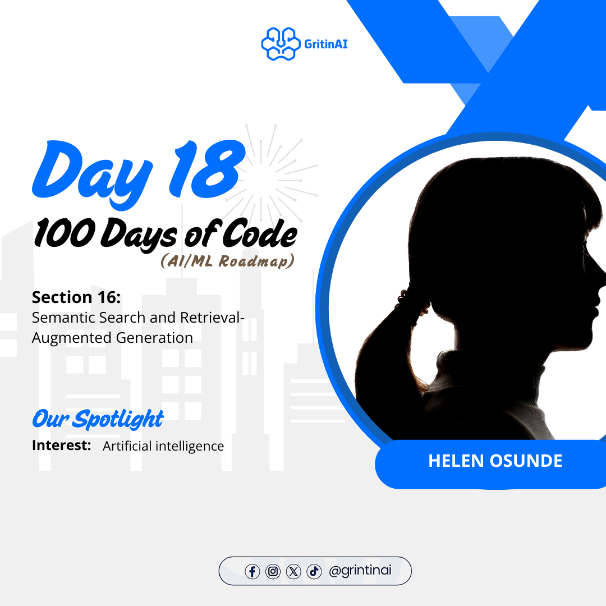

# Day 18 Resources 

## Section 16 : LLM

### Topics: Semantic Search and Retrieval-Augmented Generation
1. Overview
    * [LLM Extended](https://www.youtube.com/watch?v=orLGv2LgWDE&pp=ygUyU2VtYW50aWMgU2VhcmNoIGFuZCBSZXRyaWV2YWwtQXVnbWVudGVkIEdlbmVyYXRpb24%3D)

## Always make sure you code along each of the Resources 

